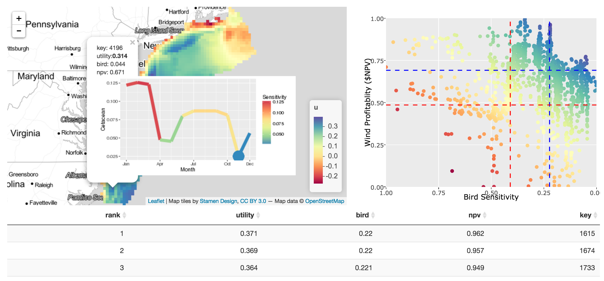

# siting

Siting offshore wind energy to minimize impacts on birds in space and whales in time

_Sites on the map (10 km2 pixels) in the US Mid-Atlantic are colored according to the average utility depicted in the tradeoff plot to: maximize profitability to offshore wind energy development (net present value in US$, on normalized scale) on y-axis, and minimizing bird sensitivity on x-axis (based on 20 bird species distributions summed and weighted by sensitivity to collision and displacement, also on a normalized scale). Click a site on the map to see the cetaceans sensitivity over time, so that episodic events that impart high acoustic energy underwater (seismic air gun surveying and pile driving) can be scheduled at times when endangered whales, such as the North Atlantic Right Whale, are generally absent._

This is a work in progress. You can see the Shiny app here:

  http://shiny.env.duke.edu/bbest/siting

## Acknowledgements

Many thanks to:
- RStudio and especially [@jcheng5](http://github.com/jcheng5) for [Shiny](http://shiny.rstudio.com/) and the integrated [leaflet](https://rstudio.github.io/leaflet/) package, now with [raster image](https://rstudio.github.io/leaflet/raster.html) support.
